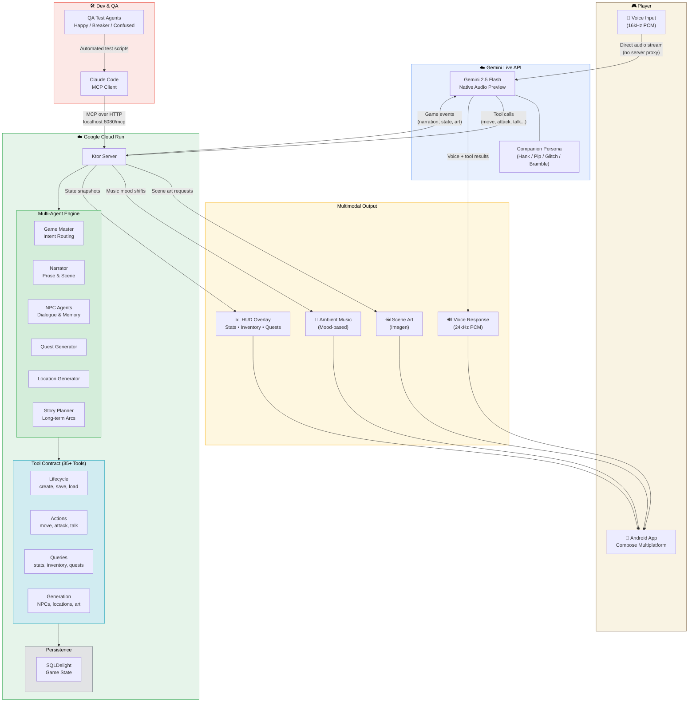
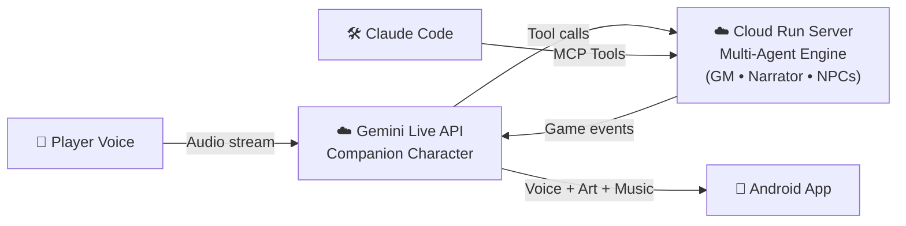

# RPGenerator Architecture Diagram

## Mermaid Source

Paste into [mermaid.live](https://mermaid.live) to export as PNG/SVG for the submission.

## Simplified Version (for slides)

## What to Emphasize in the Diagram

1. **Direct voice path** — Player ↔ Gemini Live API with no server audio proxy (low latency)
2. **Tool-mediated game state** — Gemini doesn't guess game state, it calls tools
3. **Multi-agent collaboration** — Not one prompt, 6+ specialized agents
4. **Multimodal outputs** — Voice, scene art, music, HUD all rendered simultaneously
5. **MCP for dev/QA** — Same tool API, different client (Claude Code tests what players experience)
